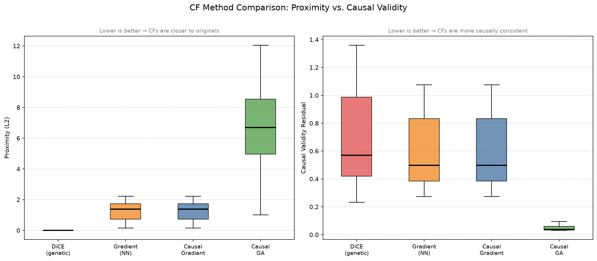
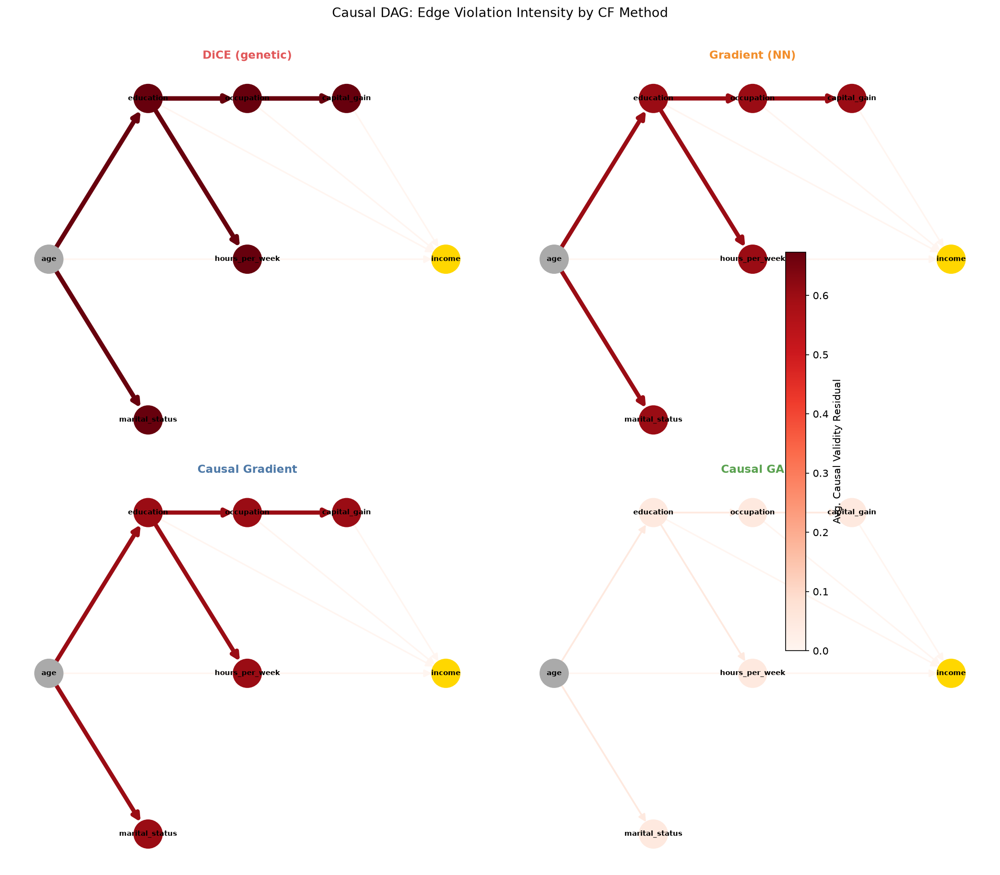
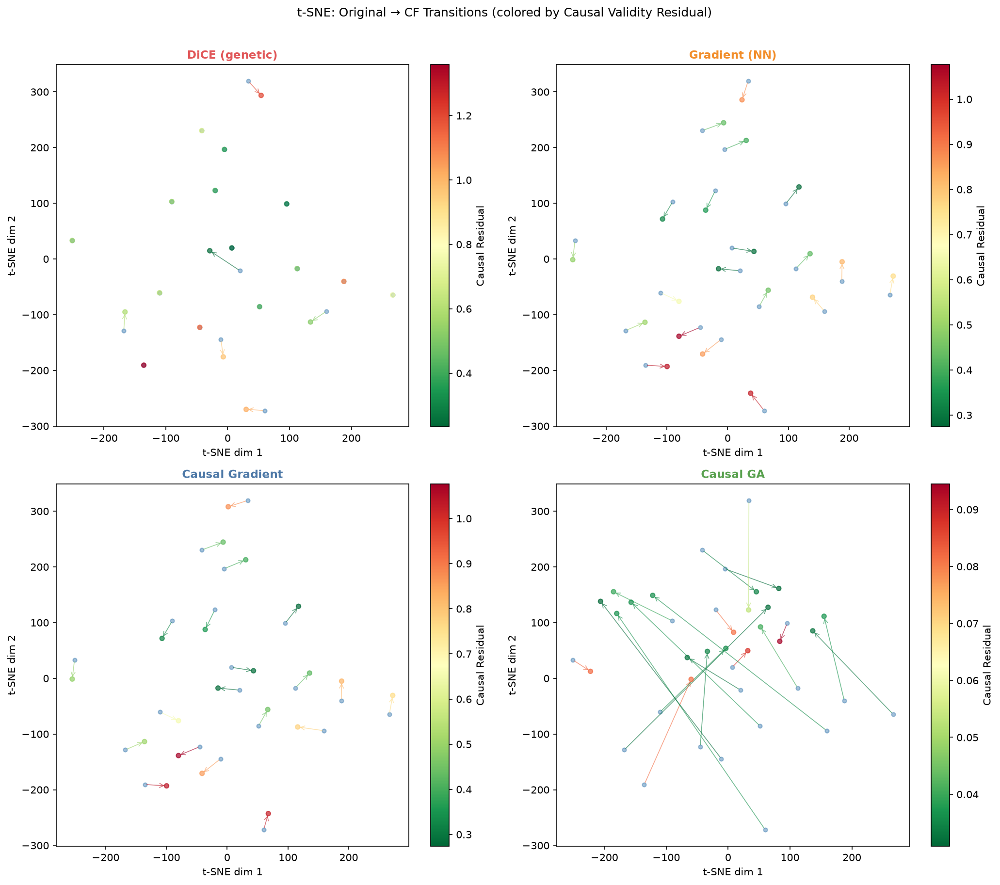

# Causal-Constrained Counterfactual Explanations

A research project extending the standard counterfactual explanation (CF) benchmark by encoding a **causal graph** over tabular features and introducing a novel **causal validity metric** — measuring whether CF methods respect the causal structure of the data, or merely exploit feature independence.

## Motivation

Standard CF methods (DiCE, gradient optimization, genetic algorithms) optimize for proximity and plausibility but ignore causal structure. A CF that changes `occupation` without adjusting `capital_gain` accordingly violates the data-generating process. This project:

1. Benchmarks 4 CF methods on the Adult Income dataset
2. Adds causal constraints via a hand-specified Structural Causal Model (SCM)
3. Introduces **causal validity residual** — a new metric quantifying how causally consistent each CF is

## Causal DAG

```
age ──────┬──► education ──┬──► occupation ──► capital_gain
          │                └──► hours_per_week
          └──► marital_status

age, education, occupation, hours_per_week, capital_gain ──► income (target)

Immutable features: age, sex, race
```

The DAG is encoded as a `networkx.DiGraph`. The SCM trains one `LinearRegression` per endogenous node, predicting it from its parents — used to propagate causal effects during CF generation and to score causal consistency.

## CF Generation Methods

| # | Method | Model | Causal-Aware |
|---|--------|-------|:---:|
| 1 | **DiCE (genetic)** | XGBoost | ✗ |
| 2 | **Gradient NN** | PyTorch NN | ✗ |
| 3 | **Causal Gradient** | PyTorch NN | ✓ |
| 4 | **Causal GA (PyGAD)** | XGBoost | ✓ |

Methods 3 & 4 either propagate downstream effects through the SCM (gradient method) or penalize causal inconsistency in the fitness function (GA method).

## Evaluation Metrics

| Metric | Description | Better |
|--------|-------------|--------|
| **Validity** | % of CFs that flip the model's prediction | Higher |
| **Proximity** | L2 distance from original to CF (normalized) | Lower |
| **Plausibility** | VAE reconstruction error on CF | Lower |
| **Causal Validity Residual** | Normalized SCM residual on downstream features | Lower |
| **Immutability Violation** | % of CFs that changed an immutable feature | Lower |

### Results

Results below from `--fast` run (20 test instances). Run `python main.py` for full 200-instance results.

| Method | Validity ↑ | Proximity ↓ | Plausibility ↓ | Causal Residual ↓ | Immut. Violation ↓ |
|---|---|---|---|---|---|
| DiCE (genetic) | 0.10 | 0.00 | 0.31 | 0.673 | 0.0 |
| Gradient (NN) | 0.15 | 1.27 | 0.41 | 0.605 | 0.0 |
| Causal Gradient | 0.15 | 1.27 | 0.37 | 0.605 | 0.0 |
| Causal GA | 0.15 | 6.44 | 0.48 | **0.049** | 0.0 |

## Sample Outputs

**Proximity vs. Causal Validity (boxplots)**


**DAG Edge Violation Heatmap**


**t-SNE Arrow Map**


## File Structure

```
causal_cf/
├── data/               # Adult Income CSV (downloaded at runtime)
├── models/             # Cached model weights
│   ├── xgb_final.pkl
│   ├── nn_final.pt
│   ├── vae_final.pt
│   └── scm_models.pkl
├── figures/            # Output PNGs + results.csv
├── causal_graph.py     # DAG definition, SCM propagation logic
├── cf_methods.py       # All 4 CF generation strategies
├── evaluate.py         # All 5 metrics
├── visualize.py        # 3 visualization functions
├── main.py             # End-to-end pipeline
└── tests/              # pytest suite (78 tests, no data download required)
requirements.txt
README.md
```

## How to Run

### Setup

```bash
# Clone the repo
git clone <repo-url>
cd <repo-dir>

# Install dependencies (pins numpy 1.26.4 — required for dice-ml compatibility)
pip install -r requirements.txt
```

### Full Run

```bash
cd causal_cf
python main.py
```

Trains all models on first run (~5-10 min), then caches them to `models/`. Subsequent runs skip training and go straight to CF generation.

### Fast Mode (for testing)

```bash
cd causal_cf
python main.py --fast
```

Uses 20 test instances, reduced GA iterations, and fewer gradient steps. Completes in ~3-5 minutes.

### Re-running from scratch

Delete the `models/` directory to force retraining:

```bash
rm -rf causal_cf/models/
python main.py
```

## Design Notes

- **DiCE uses XGBoost** (not the NN) — `dice_ml`'s sklearn backend is stable; the PyTorch backend is fragile with dice-ml 0.11.
- **SCM uses LinearRegression** — interpretable and sufficient for measuring causal consistency. Trained entirely in encoded space (z-scored numerics, LabelEncoded categoricals) — consistent with how `propagate_scm` and CF generation operate.
- **Gradient method**: SCM propagation runs inside `torch.no_grad()` — gradients do not flow through the SCM (intentional: the SCM is a constraint layer, not a differentiable component).
- **Causal residuals are normalized** by each feature's training std before averaging, making them comparable across features with different scales.

## Dependencies

Key packages and versions:

```
numpy==1.26.4       # Critical: numpy 2.x breaks dice-ml
pandas==2.2.2
scikit-learn==1.5.0
xgboost==2.0.3
torch==2.3.0
dice-ml==0.11
pygad==3.3.1
networkx==3.3
ucimlrepo==0.0.6
```

## Dataset

UCI Adult Income dataset (N ≈ 48,000 after cleaning). Binary classification: predict whether income exceeds $50K/year. Features include age, education, occupation, hours-per-week, capital gain/loss, and demographic attributes.
